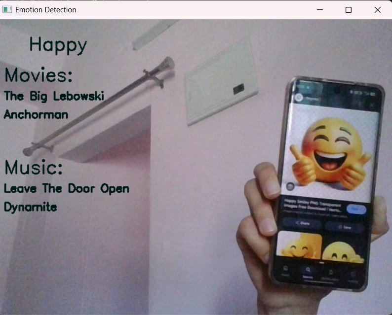
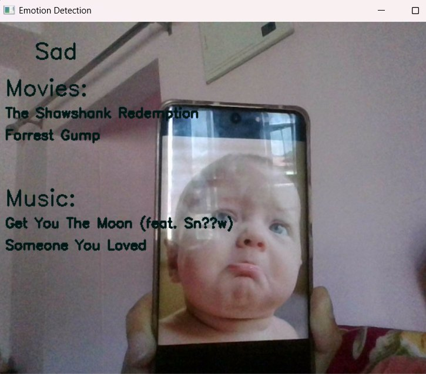

# 🎬🎵 Personalized Movie and Music Recommendation System

<p align="center">
  
  
  
  
  
</p>

<p align="center">
  A real-time <b>Emotion-Based Recommendation System</b> that detects your facial expression using <b>OpenCV</b> and a pre-trained <b>CNN model</b>, then recommends personalized <b>Movies</b> 🎬 and <b>Music</b> 🎵 based on your current mood!
</p>

---

## 📌 Table of Contents

- [About the Project](#about-the-project)
- [Features](#features)
- [Tech Stack](#tech-stack)
- [How It Works](#how-it-works)
- [Detected Emotions](#detected-emotions)
- [Project Structure](#project-structure)
- [Installation](#installation)
- [Usage](#usage)
- [Screenshots](#screenshots)
- [Notebooks Overview](#notebooks-overview)
- [Future Improvements](#future-improvements)
- [Contributing](#contributing)
- [License](#license)
- [Author](#author)

---

## 🧠 About the Project

This project uses **Computer Vision** and **Deep Learning** to detect a user's facial emotion in real-time via webcam. Based on the detected emotion, it recommends:

- 🎬 **Movies** — matched by genre to your mood
- 🎵 **Music** — matched by emotion tag to your mood

The emotion model is loaded from a saved **JSON + H5** Keras architecture, and recommendations are served from pre-processed **Pickle files** (`movie.pkl`, `music.pkl`) derived from CSV datasets.

---

## ✨ Features

- 📷 Real-time face capture using **OpenCV webcam**
- 🤖 Emotion classification using a **pre-trained CNN** (`emotiondet.json` + `emotiondet.h5`)
- 🎬 Movie recommendations based on **emotion → genre mapping**
- 🎵 Music recommendations based on **emotion tags**
- 📊 Results overlaid directly on the **live webcam feed**
- 🔴 Press `Q` to quit the application anytime

---

## 🛠️ Tech Stack

| Technology | Purpose |
|---|---|
| **Python 3.8+** | Core language |
| **OpenCV (cv2)** | Webcam capture & frame display |
| **TensorFlow / Keras** | Loading and running the CNN emotion model |
| **NumPy** | Image array processing |
| **Joblib** | Loading pickle model files |
| **Pandas** | Filtering movie/music datasets |
| **Jupyter Notebook** | Model training & experimentation |

---

## ⚙️ How It Works

```
Webcam Frame (OpenCV)
        │
        ▼
Convert to Grayscale → Resize to 64×64
        │
        ▼
Normalize (÷255) → Reshape to (1, 64, 64, 1)
        │
        ▼
CNN Model Prediction (emotiondet.json + emotiondet.h5)
        │
        ▼
Predicted Emotion Label
        │
        ├─────────────────────────────┐
        ▼                             ▼
recommend_movies(emotion)    recommend_music(emotion)
  → emotion_to_genre map       → filter music.pkl
  → filter movie.pkl             by Emotion column
  → top 2 Movie_Name             → top 2 Name
        │                             │
        └──────────────┬──────────────┘
                       ▼
         Display on Webcam Frame via cv2.putText()
```

---

## 😄 Detected Emotions & Recommendations

| Emotion | Movie Genre | Music Tag |
|---|---|---|
| 😄 **Happy** | Comedy | Happy |
| 😢 **Sad** | Drama | Sad |
| 😡 **Angry** | Action | Angry |
| 😨 **Fear** | Horror | Fear |
| 🤢 **Disguist** | Crime | Disguist |
| 😐 **Neutral** | Family | Neutral |
| 😲 **Surprise** | Fantasy | Surprise |

---

## 📂 Project Structure

```
Personalized-Movie-and-Music-Recommendations/
│
├── emotion/                      # Emotion model training resources
│
├── combined.csv                  # Combined dataset (movies + music)
├── movies.csv                    # Raw movies dataset
│
├── Emotion detect.ipynb          # Jupyter Notebook — CNN model training
├── Movie recommend.ipynb         # Jupyter Notebook — Movie recommendation logic
├── Music recommend.ipynb         # Jupyter Notebook — Music recommendation logic
│
├── Emotion.py                    # ⭐ Main script — run this to start the app
│
├── emotiondet.h5                 # Trained CNN model weights
├── emotiondet.json               # CNN model architecture (JSON format)
│
├── movie.pkl                     # Preprocessed movie dataset (pickle)
├── music.pkl                     # Preprocessed music dataset (pickle)
│
├── requirements.txt              # Python dependencies
└── README.md                     # Project documentation
```

---

## ⚙️ Installation

### Prerequisites
- Python 3.8 or above
- A working **webcam**
- pip (Python package manager)

### Steps

**1. Clone the repository**
```bash
git clone https://github.com/Ankitach780/Personalized-Movie-and-Music-Recommendations.git
cd Personalized-Movie-and-Music-Recommendations
```

**2. Create a virtual environment (recommended)**
```bash
python -m venv venv

# Windows
venv\Scripts\activate

# macOS / Linux
source venv/bin/activate
```

**3. Install all dependencies**
```bash
pip install -r requirements.txt
```

---

## 🚀 Usage

**Run the main application:**
```bash
python Emotion.py
```

- Your **webcam** opens automatically
- The system detects your **facial emotion** frame by frame
- **Emotion label**, **Movie recommendations**, and **Music recommendations** are displayed live on the video feed
- Press **`Q`** to quit

---

## 📸 Screenshots

### 😄 Happy Emotion Detected
> Movies: *The Big Lebowski*, *Anchorman* | Music: *Leave The Door Open*, *Dynamite*



---

### 😢 Sad Emotion Detected
> Movies: *The Shawshank Redemption*, *Forrest Gump* | Music: *Get You The Moon*, *Someone You Loved*



---

## 📓 Notebooks Overview

| Notebook | Purpose |
|---|---|
| `Emotion detect.ipynb` | Train the CNN model → saves `emotiondet.json` + `emotiondet.h5` |
| `Movie recommend.ipynb` | Build movie recommendation logic → saves `movie.pkl` |
| `Music recommend.ipynb` | Build music recommendation logic → saves `music.pkl` |

> ⚠️ Run notebooks only if you want to **retrain the model** or **rebuild pickle files** from scratch.

---

## 🔮 Future Improvements

- [ ] Add **Haar Cascade face detection** before emotion prediction for better accuracy
- [ ] Improve model accuracy using **Transfer Learning** (VGG16 / ResNet50)
- [ ] Build a **Flask / Streamlit web interface** instead of raw OpenCV window
- [ ] Integrate **Spotify API** for live music playback
- [ ] Integrate **TMDB API** for movie posters and real-time data
- [ ] Increase recommendations from **top 2 → top 5**
- [ ] Fix label typo: `'Disguist'` → `'Disgust'`
- [ ] Add **multi-face detection** support
- [ ] Deploy on **Heroku / Render / AWS**

---

## 🤝 Contributing

Contributions are welcome!

1. Fork the repository
2. Create a new branch: `git checkout -b feature/your-feature`
3. Commit your changes: `git commit -m "Add your feature"`
4. Push: `git push origin feature/your-feature`
5. Open a **Pull Request**

---

## 📄 License

This project is licensed under the **MIT License**.

---

## 👤 Author

**Ankita** — [@Ankitach780](https://github.com/Ankitach780)

---

<p align="center">Made with ❤️ using Python, OpenCV & Keras</p>
